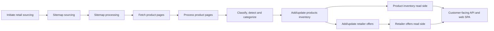

# Phase 0 Roadmap

## Overview

This is the initial phase of the product-aggregation platform. Future phases
will be defined based on Phase 0 outcomes.

Phase 0 is the MVP: scrape, match, process, and display offers for Minisforum
products sold by many retailers worldwide. Phase 0 focuses on Minisforum only.

The core domain entities are:

- **Product:** manufacturer-side canonical inventory for a Minisforum model.
- **Variant:** a product configuration such as barebones, RAM size, or SSD size.
- **Retailer:** a source store whose public product pages are scraped.
- **Offer:** retailer-side availability, price, URL, SKU, and scrape metadata for
  a product or variant.

## Architecture

- Use Rust + PostgreSQL.
- Build backend tasks in the MVP repository.
- Local development is dockerless; the dev application is dockerized.
- Phase 0 uses manual triggers instead of a scheduler.
- Full observability is deferred, but Phase 0 records enough failure data for
  manual inspection and reruns: failed stage, retailer, source URL or artifact ID,
  failure kind/message, and timestamp.

### Tech stack (current)

| Crate / dependency | Purpose                                         |
| ------------------ | ----------------------------------------------- |
| `reqwest`          | Blocking HTTP client (sitemap/product fetching) |
| `quick-xml`        | Sitemap XML parsing                             |
| `chrono`           | `lastmod` datetime handling                     |
| `thiserror`        | Error enum derive macros                        |
| `uuid`             | Entity identifiers                              |

### Code layout

| Path                                  | Crate / module                        | Roadmap stage |
| ------------------------------------- | ------------------------------------- | ------------- |
| `lib/shared/`                         | Shared types and retailer config      | —             |
| `lib/money/`                          | Exact money value type (Phase 1)      | —             |
| `apps/mvp/`                           | MVP application crate                 | All stages    |
| `src/sitemap_discovery/`              | Sitemap fetching, parsing, data model | B, C          |
| `src/retailer_data_ingestion/`        | HTTP client                           | Supporting    |
| `src/retailer_sourcing/`              | Stage A trigger logic                 | A             |
| `src/offer_discovery/`                | Product page fetching                 | D             |
| `src/offer_processing/`               | Product page parsing                  | E             |
| `src/product_information_management/` | Product write side                    | G             |
| `src/offer_information_management/`   | Offer write side                      | H             |
| `src/customer_facing/`                | API + web SPA                         | K             |

### Core entities

Logical model only; this does not commit the physical database schema.

```text
Product {
  id,
  canonical_name,
  model_name,
  brand,
  category,
  description,
  specifications,
  images
}

Variant {
  id,
  product_id -> Product.id,
  configuration,
  ram,
  storage
}

Offer {
  id,
  product_id -> Product.id,
  variant_id -> Variant.id optional,
  retailer,
  retailer_sku,
  url,
  price,
  currency (ISO 4217),
  availability,
  scraped_at
}
```

## Open Questions

Unresolved design questions that need answers before the stages that depend on
them. Captured here so they are not buried in the stage detail below.

### Product matching (Stage [G](#g-addupdate-products-inventory))

**Decide by:** before Stage G implementation starts.

How do we recognise that the same Minisforum product, sold by several different
retailers and re-scraped on every run, is one canonical product in our
inventory? This is entity resolution and it is the hardest part of the pipeline.

- **Phase 0 product/variant default:** a canonical product represents a
  Minisforum model; configurations are variants. Retailer offers point to a
  variant when configuration details are known, otherwise to the canonical
  product.
- **Matching signals, roughly best to worst:**
  - Manufacturer model name/number, for example `Minisforum UM890 Pro`. Because
    we track a single manufacturer, model names are fairly consistent and are
    likely our strongest signal.
  - Structured identifiers (GTIN / EAN / UPC / MPN) when a retailer exposes them
    in JSON-LD or Shopify product JSON. Most reliable when present, often absent.
  - Fuzzy match on normalised title + key specs (CPU, RAM, storage) as a fallback.
  - LLM-assisted matching (reuse Stage F) for ambiguous candidates.
- **Stability across runs:** matching must be idempotent. Re-scraping the same URL
  must resolve to the same product every day. Persist a
  `retailer URL/SKU -> canonical product id / variant id` mapping so re-runs are
  cheap and stable.
- **Open decisions:** key precedence, confidence threshold for auto-merge vs.
  manual review, and how to correct bad merges/splits later.

### Supporting multiple currencies (Stages [H](#h-addupdate-retailer-offers), [J](#j-support-read-side-for-retailer-offers), [K](#k-build-customer-facing-api-and-web-spa-app))

**Decide by:** before Stage H implementation starts.

"Worldwide" means retailers price in their local currency, so offers are
inherently multi-currency.

- **Always store the source price and its ISO 4217 currency code on the offer.**
  Never discard the original currency.
- **Comparison/display currency:** do we present a single normalised currency
  (for example USD, or the visitor's locale)? That needs FX rates. Pick a
  provider and refresh cadence, and treat converted values as derived.
- **Tax/VAT:** EU prices are typically VAT-inclusive and US prices ex-tax, so raw
  cross-region price comparison is misleading. Open: do we normalise tax for
  Phase 0 or just label it? Shipping is similarly excluded.
- **Open decisions:** presentation-currency strategy, FX provider + refresh
  cadence, and whether VAT normalisation is in scope for Phase 0.

### API style (Stage [K](#k-build-customer-facing-api-and-web-spa-app))

**Decide by:** before Stage K implementation starts.

Choose REST or GraphQL for the customer-facing API.

### Docker build ownership

**Decide by:** before the first dev deployment.

Choose where and how docker containers are built for the dev application.

## Stages

Dependencies:



### Implementation status

| Stage                             | Status                                                                 | Module                                |
| --------------------------------- | ---------------------------------------------------------------------- | ------------------------------------- |
| A — Initiate retail sourcing      | Not started (skeleton only)                                            | `src/retailer_sourcing/`              |
| B — Sitemap sourcing              | In progress (fetch + parse; storage not wired)                         | `src/sitemap_discovery/`              |
| C — Sitemap processing            | In progress (extraction + classification; storage + handoff not wired) | `src/sitemap_discovery/`              |
| D — Fetch product pages           | Not started (empty file)                                               | `src/offer_discovery/`                |
| E — Process product pages         | Not started (empty file)                                               | `src/offer_processing/`               |
| F — Classify, detect, categorize  | Not started                                                            | (no module yet)                       |
| G — Add/update products inventory | Not started (empty file)                                               | `src/product_information_management/` |
| H — Add/update retailer offers    | Not started (empty file)                                               | `src/offer_information_management/`   |
| I — Product inventory read side   | Not started                                                            | (no module yet)                       |
| J — Retailer offers read side     | Not started                                                            | (no module yet)                       |
| K — Customer-facing API & SPA     | Not started (empty file)                                               | `src/customer_facing/`                |

Supporting infrastructure in place:

- **Retailer configuration** (`lib/shared`): `RetailerCode` enum with 7 variants
  (EU, US, UK, FR, CA, AU, and a generic `Minisforum` code), plus
  hardcoded sitemap URLs per region.
- **HTTP client** (`src/retailer_data_ingestion/`): blocking `reqwest` client
  with browser-identifying `User-Agent`.
- **Error types**: `SitemapError` (Fetch / Parse / UnknownRetailer) via
  `thiserror`.
- **Data model** (`src/sitemap_discovery/sitemap.rs`): `SitemapDocument` tree,
  `SitemapUrl`, `SitemapImage`, `SitemapKind` (Product / Collection / Catalog /
  Other), `ChangeFrequency` with full `FromStr`/`Display`.
- **XML parser** (`src/sitemap_discovery/parse.rs`): `quick-xml`-based parser
  for `<sitemapindex>` and `<urlset>` documents, handling Shopify image
  extensions and `lastmod` dates via `chrono`.


### A. Initiate retail sourcing

Depends on architecture decisions and hardcoded retailer data.

- Trigger sitemap product sourcing for all active retailers.
- Use a manual trigger in Phase 0; automated scheduling is deferred.
- Hardcode retailer data in Phase 0 for speed; retailer management/onboarding is
  deferred.
- Create command handling for the manual sourcing trigger.
- Catalog and collection processing is deferred; Phase 0 still includes sitemap
  and product page fetching.

Done when:

- A manual trigger starts sourcing for every hardcoded active retailer.
- The trigger emits or records replayable sourcing intent for downstream stages.

### B. Sitemap sourcing

Depends on Stage A.

- Fetch and store the main sitemap file.
- Extract links to other sitemap files, including Shopify locale sitemap files.
- Fetch and store linked sitemap files.
- **Current:** recursive fetch and parse of root + child sitemaps works in-memory
  (`fetch_sitemap` → `fetch_document`). Still missing: Stage A trigger
  integration (no retailer loop yet), sitemap artifact persistence to
  PostgreSQL, and per-retailer batch runs.

Done when:

- Sitemap files for every active retailer are fetched and stored as operational
  artifacts.
- Linked sitemap discovery works for retailers with nested sitemap indexes.

### C. Sitemap processing

Depends on Stage B.

- Load the latest sitemap files for a retailer.
- Match each sitemap by URL to determine type: product, collection, or catalog.
- Extract URLs with last modified date and available metadata such as image,
  title, and product heading.
- Store extracted data in PostgreSQL.
- Send product URLs to Stage D. Collection and catalog processing are deferred.
- **Current:** URL extraction, `SitemapKind` classification from URL filename,
  `lastmod` parsing via `chrono`, image metadata extraction, and recursive
  tree queries (`all_urls`, `urls_of_kind`) are implemented. Still missing:
  PostgreSQL storage of extracted URL records, per-retailer batch processing,
  and handoff to Stage D.

Done when:

- Product URLs can be extracted from stored sitemap files for every active
  retailer.
- Product URL records include enough source metadata for fetching and reruns.

### D. Fetch product pages

Depends on Stage C.

- Fetch product pages and store raw HTML in PostgreSQL.
- Basic HTTP fetching is in scope. Anti-scraping infrastructure such as multiple
  IPs and browser agents is deferred.

Done when:

- Product pages for all active retailers can be fetched and stored from extracted
  URLs.
- Failed fetches are recorded with enough detail for manual inspection and rerun.

### E. Process product pages

Depends on Stage D.

- Load raw page data from PostgreSQL.
- Build retailer-specific HTML parser rules.
- Extract valuable product and offer information and store parsed artifacts in
  PostgreSQL.

Done when:

- Stored product pages can be parsed into product attributes and offer attributes.
- Parser failures are recorded with source URL/artifact ID and failure details.

### F. Classify, detect and categorize

Depends on Stage E.

- Use a high-capability reasoning LLM, currently Claude Opus 4.8 / GPT-5.5 as an
  illustrative snapshot expected to change, to classify each product and extract
  product-relevant data in Phase 0.
- Classification may be manually run to avoid setting up API credentials during
  Phase 0.
- Training a cheaper, faster, or local model is deferred.

Done when:

- Parsed product artifacts can be classified into the fields Stage G needs.
- Manual classification inputs and outputs are stored for traceability.

### G. Add/update products inventory

Depends on Stage F. Gated by [Product matching](#product-matching-stage-g).

- Match classified Minisforum products against existing canonical inventory.
- For Phase 0, start with deterministic model-name matching and persisted
  retailer URL/SKU mappings. Defer fuzzy and LLM-assisted matching until the
  deterministic path is working or an ambiguity requires manual review.
- Add a new canonical product when no match is found.
- Store manufacturer-side content: descriptions, features, technical
  specifications, images, and model/variant attributes. Do not store retailer
  SKUs or retailer IDs on the product.
- Event-source product, variant, and matching-decision changes.

Done when:

- Re-scraping the same retailer URL/SKU resolves to the same canonical product or
  variant.
- Product and variant events can be replayed into the product inventory read
  side.

### H. Add/update retailer offers

Depends on Stage G. Gated by [Supporting multiple currencies](#supporting-multiple-currencies-stages-h-j-k).

- Match retailer offers with products or variants from inventory.
- Add or update retailer-side data: retailer IDs, SKUs, prices, ISO 4217
  currencies, availability, URLs, and scrape timestamps.
- Store the source price and currency exactly as scraped.
- Event-source retailer offer changes.

Done when:

- Offers from every active retailer attach to a canonical product or variant.
- Offer events include source price, currency, availability, retailer identifiers,
  URL, and scrape timestamp.

### I. Support read side for product inventory

Depends on Stage G.

- Build read-side projection from product and variant inventory events.
- Support queries for product lookup and filtering.

Done when:

- Product and variant events replay into a queryable inventory projection.
- The projection supports the product lookup/filtering needed by Stage K.

### J. Support read side for retailer offers

Depends on Stage H.

- Build read-side projection from retailer offer events.
- Support queries for retailer offer lookup and filtering.

Done when:

- Offer events replay into a queryable offer projection.
- The projection supports offer lookup/filtering needed by Stage K.

### K. Build customer-facing API and web SPA app

Depends on Stages I and J. Gated by [API style](#api-style-stage-k).

- Build the customer-facing API to expose product inventory and retailer offers.
- Build a web SPA app that uses the API.

Done when:

- The SPA can display an inventory page and an offer page for a canonical product,
  populated from the read-side projections.
- The API exposes enough data for product lookup, product detail, and retailer
  offer comparison.

## Deferred Decisions

| Item                              | Affects        | Status | Decision                                                                   | Decided on |
| --------------------------------- | -------------- | ------ | -------------------------------------------------------------------------- | ---------- |
| REST vs GraphQL                   | Stage K        | TBD    | Choose customer-facing API style.                                          |            |
| Docker build location and process | Architecture   | TBD    | Choose where and how dev containers are built.                             |            |
| FX provider and refresh cadence   | Stages H, J, K | TBD    | Choose provider and derived display strategy if conversion enters Phase 0. |            |
| VAT/tax normalization             | Stages H, J, K | TBD    | Decide whether Phase 0 normalizes tax or labels regional differences.      |            |
| Product matching thresholds       | Stage G        | TBD    | Choose key precedence and auto-merge/manual-review threshold.              |            |

## Deferred to Later Phases

| Capability                         | Stage   | Notes                                                                                      |
| ---------------------------------- | ------- | ------------------------------------------------------------------------------------------ |
| Automated scheduler                | A       | Phase 0 uses manual triggers.                                                              |
| Retailer management/onboarding UI  | A       | Phase 0 hardcodes retailer data.                                                           |
| Collection and catalog processing  | A, C    | Phase 0 processes product URLs only.                                                       |
| Anti-scraping infrastructure       | D       | Multiple IPs, browser agents, and advanced bot-avoidance are deferred.                     |
| Cheaper/local classification model | F       | Phase 0 uses high-capability reasoning LLMs.                                               |
| Admin UI                           | All     | Not needed for customer-facing MVP.                                                        |
| Multi-brand support                | All     | Phase 0 focuses on Minisforum only.                                                        |
| Multi-language content             | E, F, K | Not part of Phase 0 content handling.                                                      |
| Price alerts or notifications      | K       | Not part of the initial customer-facing SPA.                                               |
| Full observability                 | All     | Automated retry policy, alerting, dashboards, and parser-breakage monitoring are deferred. |

## Out of Scope

- Multi-brand support beyond Minisforum.
- Automated scheduling.
- Catalog and collection page processing.
- Advanced anti-scraping infrastructure beyond basic HTTP fetches.
- Model training for cheaper/faster/local classification.
- Admin UI or retailer management UI.
- Multi-language content support.
- Price alerts or notification system.
- Full observability, alerting, and automated retry policy.
